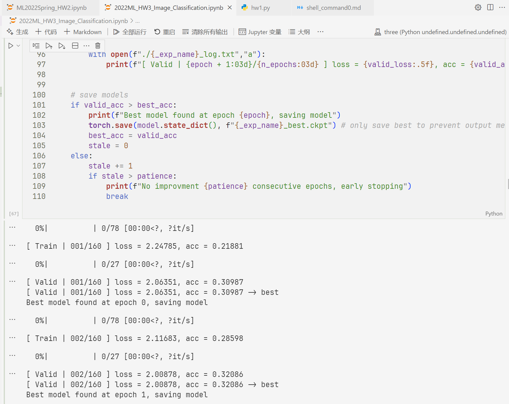
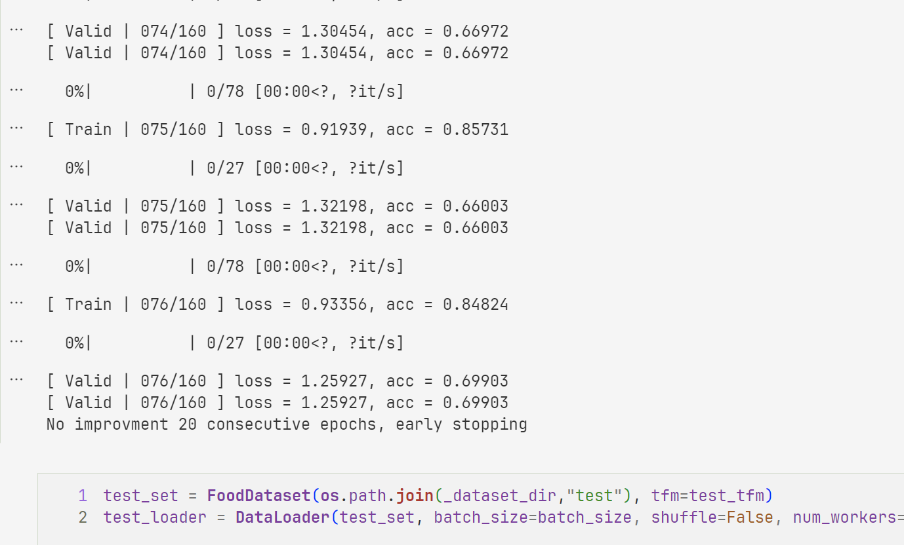
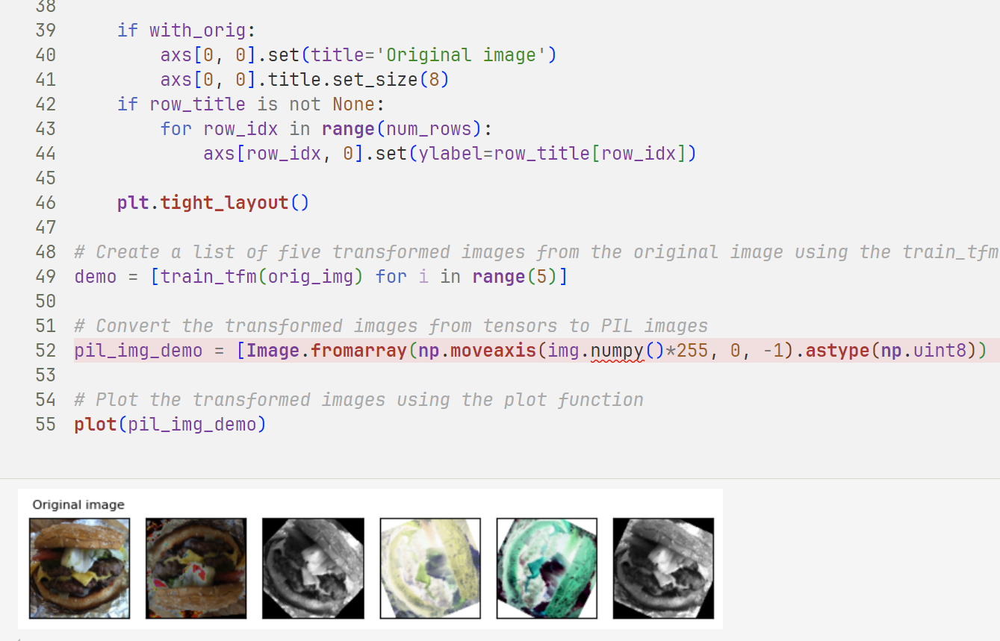
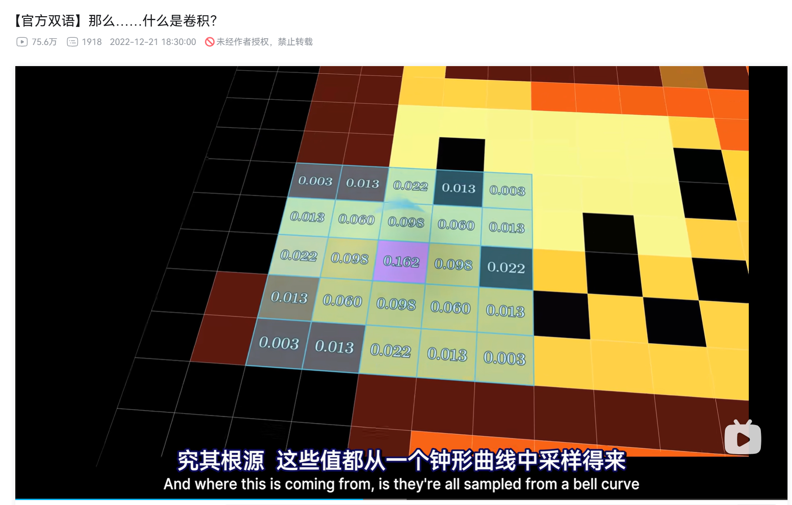

# [软件] 丁宁-X-lab报名表

# Q1:Open Source

- 请挑选一个有趣的开源项目RSSHub，并从中选取一个你认为有意思的闪光点，向我们介绍。这个闪光点可以是项目的设计创意和初衷、如何用某些独到的方式解决用户需求、整个工程的体系架构、社区的合作方式等，或者其他你认为值得被讲述的内容。当然，你也可以和我们谈谈你对自由开源软件 (FOSS) 的见解

## Step 1: 探索RSShub

- 最早听说RSShub是csdiy上有关工作流的介绍(https://csdiy.wiki/%E5%BF%85%E5%AD%A6%E5%B7%A5%E5%85%B7/workflow/#_5)

### 解决的痛点需求

- 部分高质量的信息来源，如一些个人网站,零散的个人博客or微信公众号等，分散在各处，没有app，有新文章发布也不能第一时间收到通知，这个时候就需要一种叫 RSS 的通信协议。

- 根据csdiy的描述，RSS（RDF Site Summary 或 Really Simple Syndication），中文译作简易信息聚合，也称聚合内容，是一种消息来源格式规范，用以聚合多个网站更新的内容并自动通知网站订阅者。电脑端可以借助 RSSHub Radar 来快速发现和生成 RSS 订阅源，接着使用 Feedly 来订阅这些 RSS 订阅源（RSSHub Radar 和 Feedly 在 chrome 浏览器中均有官方插件

### 探索过程

- 在chrome中添加了RSSHub Radar插件，发现了一些有趣的网站，
- 在 (feedly.com) 注册了账号，添加了一些订阅源，如知乎上的博客
- 知乎博主的效果如下：
- 
- 通过RSSHub Radar插件，订阅到Feedly后效果如下：
- 

### 学习原理

- 我理解中，RSSHub 的创新点是模块化路由系统，为每个网站或功能模块定义独立路由规则（/bilibili/user/video/:uid）通过URL参数动态匹配目标内容

- 路由规则的本质是通过 URL 路径参数动态生成 HTTP 请求，并将返回数据转换为 RSS 格式
- 技术实现中，我可能缺乏计算机网络方面的知识，希望在学习中逐渐理解
- 不过我大致了解了路径模板语法是 Express.js 风格的路由定义，例如 `/bilibili/user/video/:uid`，其中 `:uid` 为动态参数。当用户请求 `https://rsshub.app/bilibili/user/video/123456` 时，系统提取 `uid=123456` 作为后续处理的关键参数

- 总的来说，它本质上构建了可扩展的 Web 协议转换层，支持标准化输入和异构数据处理，为信息自由聚合提供了帮助

# Q2: 用ChatGPT辅助四级英语写作

- 为了高质量写作并向ChatGPT学习写作的角度和词汇等，我从Preparation Editing Proofreading Reflection四个方面进行提问和追问

## Step 1: Preparation

- **Q1: What are the potential topics for an essay that begin with:Nowadays,cultivating independent learning ability is becoming increasingly crucial for personal development."**
- A1:Here are several potential essay topics that begin with "Nowadays, cultivating independent learning ability is becoming increasingly crucial for personal development":

1. **The Role of Independent Learning in Enhancing Career Development**
   - Explore how cultivating independent learning skills can contribute to career growth, adaptability, and success in a rapidly changing job market.

2. **Independent Learning and the Future of Education**
   - Analyze how education systems can shift towards promoting independent learning and how this approach prepares students for lifelong learning.

- 等等，经过我的选择，决定选前3个

- **Q2 choose the first 3 topics and finish the draft for the essay**

- **A2:示例**

- Essay Draft on Independent Learning for Personal Development

- Introduction:**
- Nowadays, cultivating independent learning ability is becoming increasingly crucial for personal development. As society continues to evolve, the need for self-directed learners who can adapt, grow, and thrive independently has never been greater....

## Step 2: Editing

- 我采用了角色设定的方式，将GPT设定为顶级编辑，对顶级期刊的文章进行编辑，这样可以让GPT更好地理解我的需求，polish我的文章

- **Q1: Act as a top editor for top journals to improve.the clarity and flow of the following text:The Role of Independent Learning in Enhancing Career Development**

- **A1:**

- 答案示例：Gone are the days when traditional educational qualifications alone were enough to secure a stable career. 

- 这句话使用了Gone are the days when...的句式，我在Harry Potter中也看到过，是比较地道的表达，体现了GPT响应了prompt的要求

## Step 3: Proofreading

- 这阶段我关注单独的单词使用是否恰当，是否有语法错误，是否有拼写错误等

- **Q1: Can you suggest better word choices for "The ability to learn independently is a key skill that can greatly benefit individuals in their personal and professional lives."?**

- **A1:**

- 答案示例：The capacity to acquire knowledge autonomously is a fundamental competency that can significantly enhance individuals in their personal and professional endeavors.
- 这个答案示例中，capacity to acquire knowledge autonomously是一个使用高级词汇替换，体现了GPT的校对能力

## Step 4: Reflection

- 最后我也利用GPT（当作小老师）对我的聊天记录进行分析，看看我在写作过程中的优劣势，建议我在哪些方面需要改进

- **Q1: Based on our chat history, what are the main areas where I needed improvement?**

- **A1:**

- 答案示例：1.You could improve in the area of transitioning between ideas more smoothly. Your writing is clear and concise, but enhancing the flow between paragraphs could make your essays more cohesive and engaging.

- 示例中，GPT指出了我的写作中需要改进段落间的衔接，给我指出了问题所在。

# Q3: 结合题设场景，回答问题

- 假如你是一位技术团队的队长，带领一个由 8 人组成的团队，与某互联网企业合作开发一款风格化 AI 图像生成平台。团队根据项目需求分为三个小组：前端组、算法组和后端组。
1. 请结合项目背景，说明你将如何进行任务分配、协调各小组间的合作与进度管理？你会采取哪些具体措施确保跨组工作高效协作，并及时发现和解决潜在问题？

2. 经过 2 个月的探索与讨论，你们已经确定了项目的技术框架，并进入了核心需求的开发阶段。但是在项目推进过程中，团队内部出现了矛盾和冲突：
- 一位开发人员认为自己的工作分配不均且常被边缘化，情绪非常低落；
- 另一位开发人员因为繁重的学业压力，经常拖延项目进度，导致他所在小组的开发进度无法与你的要求同步。
- 请分别阐述你将如何介入、调解和化解这些冲突，并提出预防类似问题再次发生的管理机制或措施。

## Q3.1

如果我担任队长，我想结合团队分工、跨组协作工具（飞书平台等）和过往经验进行规划，下面我从任务分配、协作流程、进度管理进行回答：

### **一、任务分配-匹配能力和项目需求**
1. **分配小组任务，明确职责**
    我理解8人可能的分工如下：
   - **前端组2人**：负责GUI设计，对接企业UI团队等
   - **算法组3人**：开发和训练生成模型，通过优化CUDA算子等方式优化推理速度
   - **后端组3人**：搭建服务器,database,管理任务队列等

2. **根据能力匹配任务**
   - 根据成员技术栈分配核心任务（如算法组A同学掌握迁移训练，课程化学习等ML策略，可以负责模型训练（在题目中，比如：风格迁移模型V1版本训练）

### **二、跨组协作-利用飞书等平台实时沟通**

1. 上学期德法课小组合作中，我担任组长时，发现开会容易出现一人辛苦码字，其他人划水摸鱼的情况，因此我引入了飞书的共享文档，实现了小组多人实时编辑，有问题直接评论，减少了七嘴八舌的讨论，提升效率。在本项目中我也想利用这个优势，在组内或组间沟通中使用飞书群聊、文档功能，减少沟通成本，提高效率。
2. 利用git/github等工具进行版本管理，保证代码的可追溯性，防止因为误操作导致的代码丢失等问题
3. 为了实现问题的快速响应，可以在飞书群内设置“问题收集”bot，自动@相关成员提醒

### **三、进度管理-可视化监控和风险预警**
1. **利用甘特图可视化** 使用飞书的“项目甘特图”功能，将任务拆解为“分析→开发，测试，部署”阶段，标注验收节点等，每周更新进度百分比
2. **风险预判：** 比如若算法组的模型准确率不足，就请导师介入指导。

## Q3.2

### **对“工作分配不均导致情绪低落”的解决方案**

**1. 个体介入：深度沟通与需求挖掘**
    - 结合我最近在学的朋辈心理辅导有关知识，我会采用非暴力沟通模型，与该成员在合适的场合线下交流，了解具体的真实诉求。
   具体的说非暴力沟通模型包含：
     - **观察事实**：比如，我发现你在最近任务中负责的是文档整理，而核心代码开发参与较少。
     - **表达感受**：可以说“如果我是你的话，可能会感到被忽视，缺少归属感”
     - **倾听需求**：倾听具体的真实诉求（如希望参与技术攻坚等）

**2. 重新分配任务**
   - 让同学自学技术文档，如果反馈好，逐渐增加其参与核心开发的权重（从协助模型调参到代码编写）

### **对“学业压力导致进度拖延”的应对方式**

1.同样的，我会与该成员在合适的场合线下交流，了解真实诉求
2.如果他愿意在该项目上多投入时间，我会与他一起制定时间表，帮助他合理安排学业和项目时间
3.如果他需要以绩点为优先（比如保研等需求），我会与团队讨论减少他的工作量，同时也明确这样会影响他在组内贡献的权重，之后协调其他成员分担他的任务

### **三、预防机制与长期策略**

- 可以请向企业学习管理方式，请企业项目经理给出调解建议，提供经验（如Oncall轮值制度等）

# Q4: LeNet-5网络结构

任何学习过程、思考结果、困惑都可以被记录下来作为结果上交。
LeNet-5 是卷积神经网络（CNN）的经典模型，由 Yann LeCun 于 1998年 提出，最初用于解决 MNIST 手写数字识别任务。它的模型架构如下：https://zh.d2l.ai/_images/lenet.svg。
请你自行学习卷积神经网络相关知识，回答以下问题：

我在寒假的时候自学了李宏毅22年的ML课程3讲，学习过CNN的基本思想，完成了lab3 CNN进行图像分类任务
开始训练时如下：
- 
在完成76个epoch之后，准确率提高到了0.69903，通过了medium baseline
- 

在训练中，我也用到了Data Augmentation技术，对图片进行旋转，裁切，反色等，增强训练数据的多样性
- 

## 4.1. 什么是卷积核？它的作用是什么？
我理解的卷积核是一个小的权重系数矩阵，用于提取图像的特征

简单的卷积可以提取出图像的底层特征，如横竖边缘等，是图像分类训练的基础
为了直观理解，我参考了3Blue1Brown的视频，他用一个小的卷积核，提取了图像的边缘特征
来源视频(【官方双语】那么……什么是卷积？)
- 

## 4.2. 卷积神经网络比起之前存在的网络有什么优势？

我认为CNN是为了降低模型Flexibility，提高模型的泛化能力，从而加速训练设计的
具体可以分为以下3点来实现：
- **局部连接**：每个神经元只与输入的一小块区域连接，这样减少了参数量，提高了训练效率
- **权值共享**：每个卷积核在图像的不同位置都有相同的权重，这样减少了参数量，提高了模型的泛化能力
- **池化层**：通过池化层，减少了特征图的大小，提高了模型的泛化能力
这些是我在网课中了解到的基本知识，我也希望在之后继续学习

## 4.3. 我们现在使用的LLM是基于卷积神经网络的吗？

- 我目前的网课进行到CNN部分，还没有展开self attention,transformer等知识，所以只依靠课程可能无法回答的很准确，我通过自学李沐d2l教材和搜索总结了我的理解如下：

- 目前LLM主要基于Transformer模型，是一种基于注意力机制的模型

- CNN通过卷积提取局部特征，适合数据具有空间/局部相关性情况（如图像相邻像素），而Transformer假设数据有序列的时间前后，更适合处理文本
- 在实现上，我能大致理解的有2点不同：
    1. CNN在捕捉相距较远的词之间的关系时需堆叠多层网络，而 Transformer的自注意力机制单层可以直接关联任意距离的词
    2. Transformer的多头注意力机制可以适配 GPU 的并行计算架构，计算速度快

- 在历史上，Google 的早期 Seq2Seq 模型尝试结合 CNN 编码器，但理解比较肤浅，在2017年后，《Attention is All You Need》提出Transformer在机器翻译任务中超越 CNN/RNN，之后Transformer逐渐成为LLM的主流模型

# Appendix

- 我通过X-lab张书怀学长的推荐了解到了X-lab，在此感谢学长! 如果有幸加入X-lab，我也希望在努力成长中帮助更多的同学!
