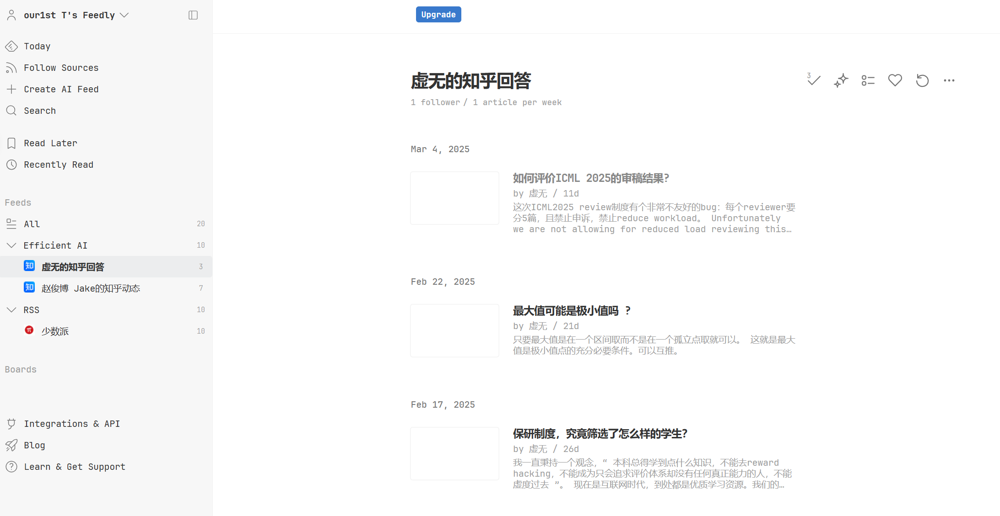

# Q1:Open Source

- 请挑选一个有趣的开源项目RSSHub，并从中选取一个你认为有意思的闪光点，向我们介绍。这个闪光点可以是项目的设计创意和初衷、如何用某些独到的方式解决用户需求、整个工程的体系架构、社区的合作方式等，或者其他你认为值得被讲述的内容。当然，你也可以和我们谈谈你对自由开源软件 (FOSS) 的见解

## Step 1: 探索RSShub

- 最早听说RSShub是csdiy上有关工作流的介绍(https://csdiy.wiki/%E5%BF%85%E5%AD%A6%E5%B7%A5%E5%85%B7/workflow/#_5)

### 解决的痛点需求

- 部分高质量的信息来源，如一些个人网站,零散的个人博客or微信公众号等，分散在各处，没有app，有新文章发布也不能第一时间收到通知，这个时候就需要一种叫 RSS 的通信协议。

- RSS（英文全称：RDF Site Summary 或 Really Simple Syndication），中文译作简易信息聚合，也称聚合内容，是一种消息来源格式规范，用以聚合多个网站更新的内容并自动通知网站订阅者。电脑端可以借助 RSSHub Radar 来快速发现和生成 RSS 订阅源，接着使用 Feedly 来订阅这些 RSS 订阅源（RSSHub Radar 和 Feedly 在 chrome 浏览器中均有官方插件

### 探索过程

- 在chrome中添加了RSSHub Radar插件，发现了一些有趣的网站，
- 在 (feedly.com) 注册了账号，添加了一些订阅源，如知乎上的博客
- 知乎博主的效果如下：
- 
- 通过RSSHub Radar插件，订阅到Feedly后效果如下：
- 

### 学习原理

RSSHub 最具突破性的设计在于其模块化路由系统，为每个网站或功能模块定义独立的「路由规则」如 /bilibili/user/video/:uid，通过URL参数动态匹配目标内容

**一、路由规则：结构化参数映射与请求分发**
- 路由规则是 RSSHub 的核心逻辑单元，本质是通过 URL 路径参数动态生成 HTTP 请求，并将返回数据转换为 RSS 格式。其技术实现可分为以下层级：

#### **1. 路由定义与参数解析**
- **路径模板语法**
  采用 Express.js 风格的路由定义，例如 `/bilibili/user/video/:uid`，其中 `:uid` 为动态参数。当用户请求 `https://rsshub.app/bilibili/user/video/123456` 时，系统提取 `uid=123456` 作为后续处理的关键参数

#### **典型场景：B站UP主视频订阅**
以 `https://rsshub.app/bilibili/user/video/123456` 为例，完整流程如下：

1. **路由解析**
   - 提取 `uid=123456`，映射到 Bilibili 模块的用户视频路由。
 
2. **请求分发**
   - 调用 Bilibili 网页版接口 `https://api.bilibili.com/x/space/arc/search?mid=123456`。
 
3. **数据清洗**
   - 从 JSON 响应中提取视频标题、封面、BV号、发布时间。
 
4. **缓存与返回**
   - 将数据封装为 RSS 的 `<item>` 节点，设置 10 分钟缓存后返回。


#### **技术价值总结**
RSSHub 的路由规则与动态适配机制，本质上构建了一个**可扩展的 Web 协议转换层**：
- **标准化输入**：通过 URL 参数定义内容来源与过滤条件
- **异构数据处理**：兼容 HTML/JSON/XML 等多种数据源
- **抗干扰能力**：动态应对反爬机制，保障服务稳定性
这种设计使得用户无需关注网站技术细节，仅通过配置化的路由即可实现「万物皆可 RSS」，是信息自由聚合的工程典范。


# Q2: 用ChatGPT辅助四级英语写作

- 为了高质量写作并向ChatGPT学习写作的角度和词汇等，我从Preparation Editing Proofreading Reflection四个方面进行提问和追问

## Step 1: Preparation

- **Q1: What are the potential topics for an essay that begin with:Nowadays,cultivating independent learning ability is becoming increasingly crucial for personal development."**
- A1:Here are several potential essay topics that begin with "Nowadays, cultivating independent learning ability is becoming increasingly crucial for personal development":

1. **The Role of Independent Learning in Enhancing Career Development**
   - Explore how cultivating independent learning skills can contribute to career growth, adaptability, and success in a rapidly changing job market.

2. **Independent Learning and the Future of Education**
   - Analyze how education systems can shift towards promoting independent learning and how this approach prepares students for lifelong learning.

- 等等，经过我的选择，决定选前3个

- **Q2 choose the first 3 topics and finish the draft for the essay**

- **A2:示例**

- Essay Draft on Independent Learning for Personal Development

- Introduction:**
- Nowadays, cultivating independent learning ability is becoming increasingly crucial for personal development. As society continues to evolve, the need for self-directed learners who can adapt, grow, and thrive independently has never been greater....

## Step 2: Editing

- 我采用了角色设定的方式，将GPT设定为顶级编辑，对顶级期刊的文章进行编辑，这样可以让GPT更好地理解我的需求，polish我的文章

- **Q1: Act as a top editor for top journals to improve.the clarity and flow of the following text:The Role of Independent Learning in Enhancing Career Development**

- **A1:**

- 答案示例：Gone are the days when traditional educational qualifications alone were enough to secure a stable career. 

- 这句话使用了Gone are the days when...的句式，我在Harry Potter中也看到过，是比较地道的表达，体现了GPT响应了prompt的要求

## Step 3: Proofreading

- 这阶段我关注单独的单词使用是否恰当，是否有语法错误，是否有拼写错误等

- **Q1: Can you suggest better word choices for "The ability to learn independently is a key skill that can greatly benefit individuals in their personal and professional lives."?**

- **A1:**

- 答案示例：The capacity to acquire knowledge autonomously is a fundamental competency that can significantly enhance individuals in their personal and professional endeavors.
- 这个答案示例中，capacity to acquire knowledge autonomously是一个使用高级词汇替换，体现了GPT的校对能力

## Step 4: Reflection

- 最后我也利用GPT（当作小老师）对我的聊天记录进行分析，看看我在写作过程中的优劣势，建议我在哪些方面需要改进

- **Q1: Based on our chat history, what are the main areas where I needed improvement?**

- **A1:**

- 答案示例：1.You could improve in the area of transitioning between ideas more smoothly. Your writing is clear and concise, but enhancing the flow between paragraphs could make your essays more cohesive and engaging.

- 示例中，GPT指出了我的写作中需要改进段落间的衔接，给我指出了问题所在。

# Q3: 结合题设场景，回答问题

- 假如你是一位技术团队的队长，带领一个由 8 人组成的团队，与某互联网企业合作开发一款风格化 AI 图像生成平台。团队根据项目需求分为三个小组：前端组、算法组和后端组。
1. 请结合项目背景，说明你将如何进行任务分配、协调各小组间的合作与进度管理？你会采取哪些具体措施确保跨组工作高效协作，并及时发现和解决潜在问题？

2. 经过 2 个月的探索与讨论，你们已经确定了项目的技术框架，并进入了核心需求的开发阶段。但是在项目推进过程中，团队内部出现了矛盾和冲突：
- 一位开发人员认为自己的工作分配不均且常被边缘化，情绪非常低落；
- 另一位开发人员因为繁重的学业压力，经常拖延项目进度，导致他所在小组的开发进度无法与你的要求同步。
- 请分别阐述你将如何介入、调解和化解这些冲突，并提出预防类似问题再次发生的管理机制或措施。

假如你是一位大学生技术团队的队长，带领一个由 8 人组成的团队，与某互联网企业合作开发一款风格化 AI 图像生成平台。团队根据项目需求分为三个小组：前端组、算法组和后端组。
Question: 请结合项目背景，说明你将如何进行任务分配、协调各小组间的合作与进度管理？你会采取哪些具体措施确保跨组工作高效协作，并及时发现和解决潜在问题？ 要求：结合你上学期德法课担任小组组长时用飞书平台，共享文档来协调进度的经验，回答问题

## Q3.1

作为大学生技术团队的队长，在与互联网企业合作开发“风格化AI图像生成平台”的项目中，我会结合团队分工、跨组协作工具（如飞书平台）和过往经验，从任务分配、协作流程、进度管理三个维度进行规划，具体方案如下：

---

### **一、任务分配：基于能力与项目需求的分层拆解**
1. **明确小组职责与目标**
   - **前端组（2人）**：负责用户界面设计、交互逻辑实现，与企业UI/UX团队对接，确保设计稿落地。
   - **算法组（3人）**：开发风格迁移/生成模型，优化推理速度，与企业算法工程师协作调试API接口。
   - **后端组（3人）**：搭建服务器架构、数据库设计，实现用户管理、任务队列和与企业云服务的对接。

2. **个性化任务匹配**
   - 根据成员技术栈分配核心任务（如算法组内部分工为模型训练、数据处理、性能优化）。
   - 使用飞书“任务管理”功能创建子任务清单，关联负责人与截止时间，例如：
     ```
     [任务示例]
     名称：风格迁移模型V1版本训练
     负责人：算法组A同学
     截止时间：3月20日
     依赖项：后端组提供训练数据接口（3月15日前）
     ```
   - 结合德法课经验，在飞书文档中设置“任务状态看板”（待处理/进行中/已完成/受阻），实时同步进展。

---

### **二、跨组协作：飞书平台驱动的无缝沟通**
1. **建立标准化协作流程**
   - **每日异步同步**：要求各小组在飞书群内以“关键词+进度”形式汇报（如“#前端进展：登录页开发完成80%”），避免信息过载。
   - **周会深度对齐**：每周通过飞书视频会议进行三方同步，重点讨论接口对接、需求变更和风险项（如算法组需后端支持数据缓存优化）。
   - **共享文档集中管理**：
     - 主文档：项目需求说明书、接口文档、测试用例（全员可编辑，历史版本可追溯）。
     - 分组合辑：前端设计稿链接、算法实验日志、后端API文档（通过飞书“多维表格”关联）。

2. **解决依赖与冲突**
   - **接口先行**：强制要求跨组协作任务（如前后端接口定义）在飞书文档中提前约定字段格式，减少后期联调冲突。
   - **问题快速响应**：借鉴德法课中“问题池”机制，在飞书群内设置“问题收集”机器人，自动归类并@相关成员，超24小时未解决则升级至队长协调。

---

### **三、进度管理：数据化监控与风险预警**
1. **里程碑与甘特图可视化**
   - 使用飞书“项目甘特图”模板，将任务拆解为“需求分析→原型开发→联调测试→上线部署”四大阶段，标注关键里程碑（如企业验收节点）。
   - 每周更新进度百分比，对比计划与实际时间线，偏差超过10%时触发预警（如算法模型训练因数据不足延迟）。

2. **风险预判与应对**
   - **技术风险**：算法组定期提交模型性能报告至飞书文档，若准确率未达预期，协调企业导师介入调参。
   - **协作风险**：通过飞书“日程统计”功能监控会议参与率，低于80%的小组需提交书面说明，避免沟通断层。

3. **激励机制**
   - 在飞书群内设置“进度之星”每周评选，基于任务完成度和协作贡献度投票，奖励优先选择企业实习推荐名额。

---

### **四、过往经验复用与优化**
上学期德法课小组合作中，我通过飞书文档实现“任务分派→进度追踪→问题归档”的全流程管理，显著提升效率。在本项目中进一步优化：
1. **模板复用**：直接套用德法课的会议纪要模板，新增“技术决策记录”模块。
2. **自动化提醒**：设置飞书机器人定时推送任务截止提醒（如“后端组数据接口剩余2天”）。
3. **企业协同适配**：为企业导师开通飞书文档“只读权限”，确保外部成员可随时查看进展但避免误操作。

---

### **总结**
通过飞书平台实现任务透明化、协作标准化和进度数据化，结合分层责任机制与风险预警，既能发挥学生团队灵活性，又能满足企业级项目的严谨性要求。最终目标是让80%的沟通成本通过工具自动解决，使团队聚焦于核心开发工作。

## Q3.2


作为团队负责人，面对开发阶段出现的成员情绪与进度冲突，我会从**个体沟通、团队协作机制优化、长期预防措施**三个层面介入解决，具体策略如下：

---

### **一、针对“工作分配不均导致成员情绪低落”的调解方案**
#### **1. 个体介入：深度沟通与需求挖掘**
   - **私下1v1沟通**：
     立即与该成员单独面谈（或视频会议），采用**非暴力沟通模型**：
     - **观察事实**：“我注意到你在最近两次任务中负责的是辅助性文档整理，而核心代码开发参与较少。”
     - **表达感受**：“我担心这种安排可能让你感到被忽视，这对团队和你个人都是损失。”
     - **倾听需求**：引导其表达真实诉求（如希望参与算法优化、技术攻坚等）。
   - **能力匹配验证**：
     结合其技术特长（如擅长Python但未被分配到算法组），与算法组负责人复盘任务分配逻辑，确认是否存在误判或信息不对称。

#### **2. 行动调整：重新定位角色与可见度提升**
   - **任务再分配**：
     根据沟通结果，调整其参与核心模块（如从文档整理转为协助模型调参），并在飞书任务看板中明确标注其新职责。
   - **贡献可视化**：
     在周会中增设“亮点分享”环节，公开肯定其阶段性成果（如“A同学优化了数据预处理流程，使训练效率提升15%”），增强价值感。

#### **3. 预防机制：动态任务池与能力评估**
   - **飞书“能力-任务”匹配表**：
     创建多维表格，横向列成员技能标签（如前端框架熟练度、算法复现经验），纵向列任务技术需求，实现自动化推荐匹配。
   - **双周角色轮换试点**：
     允许成员在非关键路径任务中申请调岗，例如后端组成员可申请参与前端交互设计讨论，拓宽参与面。

---

### **二、针对“学业压力导致进度拖延”的应对策略**
#### **1. 紧急干预：弹性调整与资源支持**
   - **学业-项目时间整合**：
     与该成员共同制定**时间分配表**，使用飞书日历同步其课程Deadline与项目节点，优先保障关键任务（如考前一周减少其开发任务量）。
   - **任务拆解与微交付**：
     将原任务拆分为多个“1小时可完成”的微任务（如“每日完成1个API接口字段定义”），通过飞书机器人每日推送提醒并验收。
   - **临时支援机制**：
     协调同组其他成员组成“备份小队”，在其学业高峰期接管部分代码（需签署飞书协作文档中的责任转移协议）。

#### **2. 长期减压：敏捷开发与容错设计**
   - **迭代周期缩短**：
     将开发模式从“瀑布式”改为2周为一个迭代周期，允许其根据学业安排灵活调整单周贡献量。
   - **自动化测试前置**：
     通过CI/CD工具自动检测其提交代码的基础错误，减少返工时间（如配置飞书机器人推送测试报告）。

#### **3. 预防机制：负荷监控与压力预警**
   - **飞书“压力指数”匿名问卷**：
     每周发放轻量级问卷（3-5题），量化成员时间压力与情绪状态，对连续两周评分低于阈值者主动介入。
   - **学业季弹性公约**：
     在期中/期末考前1个月启动“护航计划”，允许成员申请降低任务权重（需提前2周报备并提交学习计划）。

---

### **三、系统性优化：构建抗冲突的团队协作生态**
#### **1. 透明化协作体系**
   - **飞书“三维进度墙”**：
     在知识库中建立全局视图：
     - **X轴**：任务模块（前端/算法/后端）
     - **Y轴**：进度状态（开发中/联调/测试）
     - **Z轴**：个人贡献热力图（代码提交量、文档更新次数）
   - **冲突预演工作坊**：
     每月模拟典型冲突场景（如需求变更引发争执），训练成员使用“利益-需求”分析法达成共识。

#### **2. 双轨激励机制**
   - **技术贡献积分制**：
     根据任务难度、协作度发放积分，积分可兑换企业提供的技术书籍或实习面试直通卡。
   - **情感账户建设**：
     设立“能量补给站”飞书群，鼓励成员发送“点赞卡”（如“感谢B同学帮我调试跨域问题！”），每月积分最高者获团队纪念品。

#### **3. 企业协同保障**
   - **企业导师介入机制**：
     对长期未解决的冲突，邀请企业项目经理参与调解，提供行业级团队管理经验（如互联网公司Oncall轮值制度）。
   - **资源弹性池**：
     与企业协商预留10%的备用开发资源（如云计算资源、测试账号），在个别成员进度滞后时快速填补缺口。

---

### **总结**
通过**个体精准干预+流程弹性化改造+系统性预防**的三层响应机制，既解决当前冲突，更构建可持续的协作生态。核心逻辑是：**将人的情绪转化为改进流程的数据，将临时冲突固化为预防机制**，最终实现“压力可量化、冲突可预测、资源可调度”的良性循环。
