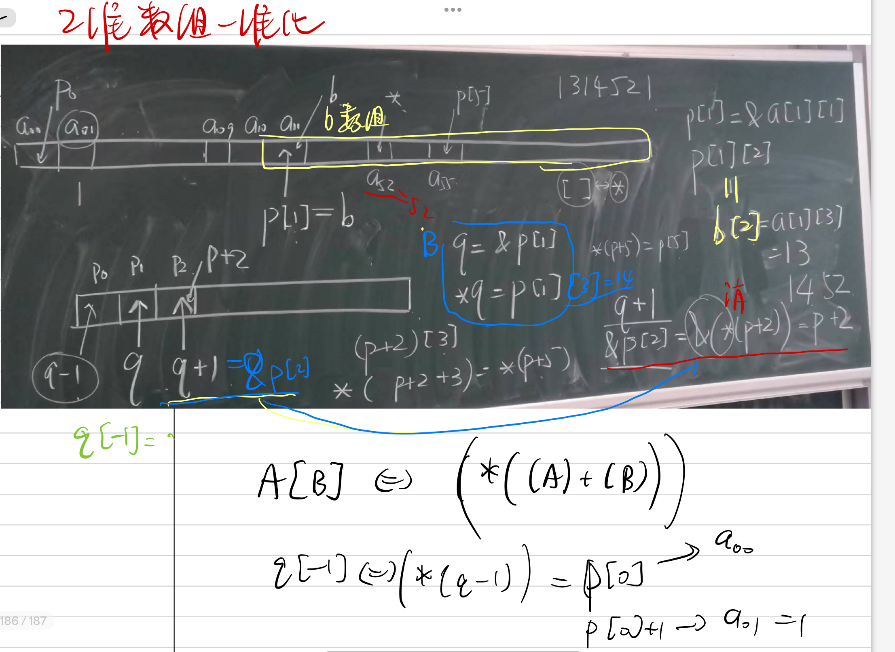
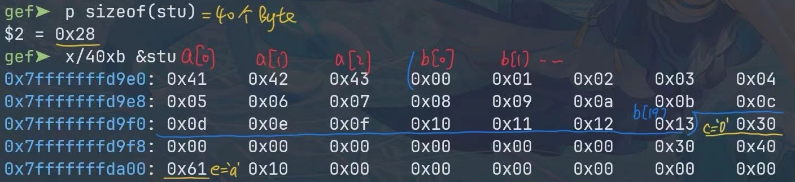

## 详细分析并判断对错:

!!! info
    - [原卷网址](https://www.luogu.com/article/y1z2mx28)
    - [讲解](https://n.dingtalk.com/dingding/live-room/index.html?roomId=hS4XibfojPnSqNtA&from=LiveHome&liveUuid=cb0807f5-d97a-4882-88ad-dba6aff2101d)

!!! warning
    - 在函数的参数传递中(如printf)，参数从右向左传递or计算
    -  看到`for while` 循环**注意循环末尾的分号** (`;`)

## 关于指针

[ckc-pointer](https://ckc-agc.bowling233.top/programming/common/notes/pointers/#_10)



## %o等占位符

在 C 语言中，`printf` 的占位符用于格式化输出。你提到的 `%o`、`%x` 和 `%X` 是用来输出整数的不同进制表示形式。让我们详细分析这些占位符的含义及其用途。

### 1. **`%o` — 八进制整数**

- **含义**：`%o` 用于输出 **八进制**（base 8）整数。
- **缩写**：`o` 代表 **Octal**（八进制）。
- **使用**：八进制是以 8 为基数的数字系统，使用的数字是 `0` 到 `7`。
  
#### 示例：

```c
#include <stdio.h>

int main() {
    int num = 63;
    printf("%o\n", num);  // 输出八进制表示
    return 0;
}
```

**输出**：
```
77
```

解释：`63` 的八进制表示是 `77`，在八进制中，`63` 可以被表示为 `7 * 8^1 + 7 * 8^0 = 77`。

### 2. **`%x` — 十六进制小写整数**

- **含义**：`%x` 用于输出 **十六进制**（base 16）整数，且使用 **小写字母** `a-f` 表示 10 到 15 之间的数字。
- **缩写**：`x` 代表 **Hexadecimal**（十六进制）。
  
#### 示例：

```c
#include <stdio.h>

int main() {
    int num = 255;
    printf("%x\n", num);  // 输出十六进制表示（小写字母）
    return 0;
}
```

**输出**：
```
ff
```

解释：`255` 的十六进制表示是 `ff`，在十六进制中，`255` 可以被表示为 `15 * 16^1 + 15 * 16^0 = ff`。

### 3. **`%X` — 十六进制大写整数**

- **含义**：`%X` 用于输出 **十六进制**（base 16）整数，且使用 **大写字母** `A-F` 表示 10 到 15 之间的数字。
- **缩写**：`X` 也代表 **Hexadecimal**（十六进制），但是输出时使用大写字母。

#### 示例：

```c
#include <stdio.h>

int main() {
    int num = 255;
    printf("%X\n", num);  // 输出十六进制表示（大写字母）
    return 0;
}
```

**输出**：
```
FF
```

解释：`255` 的十六进制表示是 `FF`，在十六进制中，`255` 可以被表示为 `15 * 16^1 + 15 * 16^0 = FF`。

### 总结：

- `%o`：输出整数的 **八进制** 表示（`Octal`）。
- `%x`：输出整数的 **十六进制** 表示，使用 **小写字母**（`hexadecimal`）。
- `%X`：输出整数的 **十六进制** 表示，使用 **大写字母**（`HEXadecimal`）。

### 其他相关格式化输出：

- **`%d`**：输出 **十进制**（`decimal`）整数。
- **`%u`**：输出 **无符号十进制**（`unsigned decimal`）整数。
- **`%f`**：输出 **浮点数**（`floating-point`）。


### 程序分析

```c
#include<stdio.h>
int main(){
    int s=0, i, j;
    for(i=1; i<=10; i++);   // 第一个错误的循环
        s = s + i;            // 循环体
        i = i + 1;            // 再修改 i
    if(s = 25)               // 赋值语句错误
        j = 1;
    else
        j = 0;
    printf("%d %d %d", s, i, j);
    return 0;
}
```

### 逐行分析：

#### 1. **变量声明**

```c
int s = 0, i, j;
```

- `s` 初始化为 0，用来存储后续计算的结果。
- `i` 和 `j` 是局部变量，尚未初始化。

#### 2. **`for` 循环**

```c
for(i = 1; i <= 10; i++);
```

- 这里的 `for` 循环是一个有语法错误的循环。**注意循环末尾的分号** (`;`)。
- `for` 循环后面紧跟的分号表示循环体为空。即，循环只做迭代，而没有实际的操作。因此，`i` 会从 1 增加到 10，但不会执行任何语句。循环结束后，`i` 的值为 11。

#### 3. **循环后的代码**

```c
s = s + i;  // s = s + 11
i = i + 1;  // i = 11 + 1 = 12
```

- 因为 `i` 在上面的循环结束时为 11，所以 `s = s + i` 执行时，`s` 变为 `0 + 11 = 11`。
- 然后，`i = i + 1` 将 `i` 增加为 12。此时，`i` 的值为 12。

#### 4. **`if` 语句**

```c
if(s = 25)
    j = 1;
else
    j = 0;
```

- 注意到 `if` 条件中的 `s = 25` 是 **赋值操作**，而不是比较操作。
  - `s = 25` 将 `s` 的值赋为 25，并且整个赋值表达式的结果是 25。
  - 在 C 语言中，任何非零值都被认为是 `true`，所以 `if` 条件成立，即执行 `j = 1`。
- 由于 `s = 25`，`s` 的值变为 25，`j` 被设置为 1。

#### 5. **`printf` 语句**

```c
printf("%d %d %d", s, i, j);
```

- 此时：
  - `s = 25`（在 `if` 语句中被赋值为 25）。
  - `i = 12`（在 `for` 循环结束后通过 `i = i + 1` 修改为 12）。
  - `j = 1`（在 `if` 语句中被设置为 1）。
  
所以，`printf` 输出的值为：
```
25 12 1
```

### 总结输出

程序的最终输出是：

```
25 12 1
```


!!! warning
    sizeof不是函数而是运算符

```c
#include<stdio.h>
void f(){
	static int x;
	x++;
	return ;
}
int main(){
	f();
	printf("%d",x);
	return 0;
}    
```
!!! info
    - static int x作用域仅限于f(x)中
    - main()中没有x
    - 输出随机数

在 C 语言中，访问结构体（`struct`）的元素有两种主要的方法：**点操作符** (`.`) 和 **箭头操作符** (`->`)。这两种操作符用于不同的场景，根据你如何持有结构体变量（通过直接变量或指向结构体的指针）来选择使用不同的访问方式。

### 1. **点操作符（`.`）**

点操作符用于访问结构体变量的成员。你可以直接通过结构体变量访问其成员。

#### 语法：
```c
struct_name.member_name
```


### 2. **箭头操作符（`->`）**

箭头操作符用于通过指针访问结构体的成员。当你持有一个指向结构体的指针时，必须使用箭头操作符来访问结构体的成员。箭头操作符是点操作符和解引用操作符的结合体。

#### 语法：
```c
pointer_to_struct->member_name
```


### 3. **点操作符与箭头操作符的比较**

- **点操作符 (`.`)** 用于访问 **结构体变量** 的成员。当你直接声明一个结构体变量时，使用点操作符来访问成员。
  
- **箭头操作符 (`->`)** 用于访问 **结构体指针** 指向的结构体的成员。当你有一个指向结构体的指针时，使用箭头操作符来访问成员。

### 4. **例子：完整的对比**

```c
#include <stdio.h>

struct Student {
    char name[50];
    int age;
    float grade;
};

int main() {
    // 1. 使用结构体变量
    struct Student stu1 = {"John", 20, 88.5};
    
    // 使用点操作符访问结构体成员
    printf("Using struct variable:\n");
    printf("Name: %s\n", stu1.name);
    printf("Age: %d\n", stu1.age);
    printf("Grade: %.2f\n", stu1.grade);

    // 2. 使用结构体指针
    struct Student *ptr;
    ptr = &stu1;

    // 使用箭头操作符访问结构体成员
    printf("\nUsing struct pointer:\n");
    printf("Name: %s\n", ptr->name);
    printf("Age: %d\n", ptr->age);
    printf("Grade: %.2f\n", ptr->grade);

    return 0;
}
```

### **输出：**

```
Using struct variable:
Name: John
Age: 20
Grade: 88.50

Using struct pointer:
Name: John
Age: 20
Grade: 88.50
```

### 5. **总结：**

- **点操作符 (`.`)**：用于直接访问结构体变量的成员。
- **箭头操作符 (`->`)**：用于通过结构体指针访问结构体的成员。

**关键点**：
- 如果你有一个结构体变量，使用 `.` 来访问成员。
- 如果你有一个结构体指针，使用 `->` 来访问指针所指向的结构体成员。

在 C 语言中，`free` 函数用于释放之前通过 `malloc`、`calloc` 或 `realloc` 分配的内存空间。当调用 `free` 释放掉一个指针指向的内存后，**指针变量本身并不会被自动置为 `NULL`**。但是，通常的良好编程实践是，在 `free` 之后手动将指针变量设置为 `NULL`。我们可以详细分析这一点。

### 1. `free` 函数的作用

`free` 函数用于释放动态分配的内存。它的语法如下：

```c
void free(void *ptr);
```

`ptr` 是一个指向先前通过 `malloc`、`calloc` 或 `realloc` 分配的内存块的指针。调用 `free(ptr)` 会释放 `ptr` 指向的内存块，但指针 `ptr` 本身并不会改变，它仍然指向原来的内存地址。

#### 例子：

```c
#include <stdio.h>
#include <stdlib.h>

int main() {
    int *ptr = malloc(sizeof(int) * 10);  // 动态分配内存

    // 使用 ptr 指向的内存
    ptr[0] = 5;

    free(ptr);  // 释放内存

    // ptr 仍然指向已释放的内存（悬挂指针）
    printf("%p\n", ptr);  // 输出指针的地址
    return 0;
}
```

在这个例子中，调用 `free(ptr)` 释放了 `ptr` 指向的内存块，但 `ptr` 仍然持有原来内存地址的值。此时，`ptr` 成为一个 **悬挂指针（Dangling Pointer）**，指向的内存已经被释放，但指针本身仍然存在且指向已经无效的内存区域。

### 2. **指针值不会被自动置为 `NULL`**

C 标准库中的 `free` 函数并不会改变指针变量本身的值。`ptr` 变量仍然保留它原先的地址，尽管该地址所指向的内存已经被释放。

这种情况下，指针会变成悬挂指针，访问它会导致未定义行为（可能是崩溃或其他不可预测的结果）。

### 3. **悬挂指针的危险**

悬挂指针会导致程序的运行变得不安全。例如，在上述代码中，如果在调用 `free` 后继续访问 `ptr`，会读取已经释放的内存，可能导致程序崩溃或错误行为。

### 4. **手动将指针置为 `NULL`（良好习惯）**

为了避免悬挂指针，最佳实践是，在调用 `free` 之后将指针变量置为 `NULL`。`NULL` 是一个特殊的常量，表示指针不指向任何有效的内存地址。

如果将指针设为 `NULL`，之后再访问该指针时，程序可以检查指针是否为 `NULL`，从而避免错误的内存访问：

```c
#include <stdio.h>
#include <stdlib.h>

int main() {
    int *ptr = malloc(sizeof(int) * 10);  // 动态分配内存

    // 使用 ptr 指向的内存
    ptr[0] = 5;

    free(ptr);   // 释放内存
    ptr = NULL;  // 将指针置为 NULL，避免悬挂指针

    // 尝试使用 ptr 会发现它是 NULL，避免了错误
    if (ptr == NULL) {
        printf("ptr is NULL after free.\n");
    }
    return 0;
}
```

在这个例子中，`ptr = NULL` 使得指针在释放内存后变为 `NULL`，避免了悬挂指针的问题。如果以后再次访问 `ptr`，可以通过检查 `ptr == NULL` 来判断是否已经释放了内存。

### 5. **常见误解：**

有时候会听到类似的说法：“`free` 会将指针置为 `NULL`”。但这并不正确，`free` 只是释放内存并不会改变指针变量的值。如果程序员希望避免悬挂指针，就必须手动将指针设置为 `NULL`。

### 6. **总结：**

- **`free` 函数**：释放内存块，但不会自动将指针变量设置为 `NULL`。
- **悬挂指针**：释放内存后，指针变量仍然指向已经无效的内存地址，这时它被称为悬挂指针。
- **避免悬挂指针的良好做法**：在调用 `free` 后，手动将指针设置为 `NULL`，这样可以避免程序错误访问已释放的内存。

通过这种方式，可以显著提高程序的健壮性，避免由悬挂指针引起的各种错误。

为了准确判断结构体 `struct student` 占用的内存字节数，我们需要仔细分析结构体中每个成员的大小和对齐方式。
## TLDR ver

!!! info
    - 先算整个struct 33 Byte
    - 向最大的类型对齐
    - 发现最大的是double 8 Byte
    - 33 对 8 上取整
    - 最终占用40 Byte

## Sample
```c
#include <stdio.h>

struct student
{
    char a[3];
    char b[20];
    char c;
    double d;
    char e;
};

int main()
{
    struct student stu;
    int a, b;

    stu.a[0] = 'A', stu.a[1] = 'B', stu.a[2] = 'C';
    for (int i = 0; i < 20;i++)
        stu.b[i] = i;
    stu.c = '0';
    stu.d = 16.0;
    stu.e = 'a';

    

    return 0;
}
```
### GDB memory




### 结构体定义：

```c
struct student{
    char a[3];  // 3 字节
    char b[20]; // 20 字节
    char c;     // 1 字节
    double d;   // 8 字节
    char e;     // 1 字节
};
```

### 结构体内存布局分析：

1. **`char a[3]`**：
   - `a` 是一个字符数组，包含 3 个 `char` 类型的元素。每个 `char` 占 1 字节。
   - 所以 `a` 占用 3 字节。

2. **`char b[20]`**：
   - `b` 是一个字符数组，包含 20 个 `char` 类型的元素。每个 `char` 占 1 字节。
   - 所以 `b` 占用 20 字节。

3. **`char c`**：
   - `c` 是一个 `char` 类型的变量，占用 1 字节。

4. **`double d`**：
   - `d` 是一个 `double` 类型的变量。在大多数平台上，`double` 通常占用 8 字节。
   - 需要注意的是，`double` 类型通常要求 8 字节对齐，即它的起始地址必须是 8 的倍数。

5. **`char e`**：
   - `e` 是一个 `char` 类型的变量，占用 1 字节。

### 内存对齐：

在 C 语言中，结构体的内存布局通常会受到内存对齐规则的影响。通常情况下，结构体成员会按照它们类型的对齐要求进行排列，可能会导致"填充"（padding）字节。

- 对于 `char` 类型的成员（如 `a[3]`, `b[20]`, `c`, `e`），它们的对齐要求通常是 1 字节，所以它们之间不会有填充。
- 对于 `double` 类型的成员 `d`，它的对齐要求通常是 8 字节。因此，`d` 必须位于一个 8 字节对齐的地址。为了保证对齐，在 `char` 类型的成员之后，可能会有额外的填充字节。

### 内存布局的详细推算：

- `a[3]` 占 3 字节，放在结构体的前面。
- `b[20]` 紧随其后，占用 20 字节。
- `c` 紧随 `b[20]` 占用 1 字节。
- 到这里，总共已经使用了 3 + 20 + 1 = 24 字节，但是为了保证 `double d` 8 字节对齐，编译器会在 `c` 和 `d` 之间填充 0 个字节。
- `d` 占用 8 字节。
- 最后，`e` 占用 1 字节。为了确保结构体的大小是 8 字节对齐，可能会在 `e` 后填充 7 字节。

### 总内存大小：

- `a[3]` 占 3 字节。
- `b[20]` 占 20 字节。
- `c` 占 1 字节。
- `d` 占 8 字节。
- `e` 占 1 字节。
- 填充 7 字节（为了对齐整个结构体的大小为 8 字节的倍数）。

因此，总的内存大小为：

```
3 (a) + 20 (b) + 1 (c) + 8 (d) + 1 (e) + 7 (padding) = 40 字节。
```

### 对齐规则及实际占用字节：

根据对齐规则，结构体的大小是 8 字节的倍数，所以最终结构体的大小将向上取整为 40 字节。因此，结构体 `student` 实际占用 40 字节的内存。


### 程序代码：
```c
#include<stdio.h>
int main(){
    char str[]="67656";
    printf("%d",sizeof(str));
}
```

### 代码分析：

1. **定义字符串数组 `str[]="67656";`**  
   在C语言中，字符串常量 `"67656"` 是以空字符 `'\0'` 结尾的字符串。因此，`"67656"` 实际上是一个包含 6 个字符的数组：`{'6', '7', '6', '5', '6', '\0'}`。

   - 字符 `'6'` 的 ASCII 值是 54。
   - 字符 `'7'` 的 ASCII 值是 55。
   - 字符 `'5'` 的 ASCII 值是 53。
   - 字符 `'\0'` 是空字符，表示字符串的结束。

   所以，`str` 数组将包含以下 6 个字符：

   ```
   str = {'6', '7', '6', '5', '6', '\0'}
   ```

2. **`sizeof(str)` 的计算**  
   `sizeof` 操作符返回的是变量所占的内存大小（字节数）。在这里，`str` 是一个字符数组，`sizeof(str)` 返回的是 `str` 数组的总字节数。

   - `str[]` 的大小取决于数组中元素的数量。在这个例子中，`str` 数组包含 6 个字符（包括结束符 `'\0'`）。
   - 因为每个字符（`char` 类型）的大小是 1 字节，所以 `sizeof(str)` 的结果就是 6 字节。
